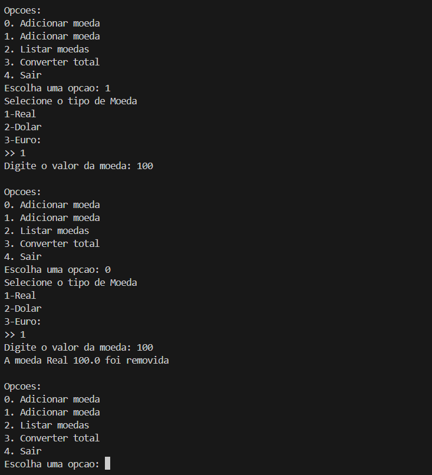

# Documentação do Projeto Cofrinho

## Introdução
Este projeto simula um cofrinho virtual, permitindo adicionar, remover, listar moedas e converter valores entre diferentes moedas. É uma adaptação de um projeto originalmente em Java para Python, utilizando os princípios de Programação Orientada a Objetos (POO).

---

## Estrutura do Código

### Classe `Moeda`
#### Descrição
Representa uma moeda com tipo e valor, permitindo conversões entre diferentes moedas.

#### Atributos
- `tipo`: (*str*) O tipo da moeda (e.g., `Real`, `Dolar`, `Euro`).
- `valor`: (*float*) O valor da moeda.

#### Métodos
- **`__init__(self, tipo, valor)`**  
  Construtor que inicializa o tipo e valor da moeda.
- **`info(self)`**  
  Exibe as informações da moeda no formato: `"{tipo}: {valor}"`.
- **`converter(self, para)`**  
  Converte o valor da moeda para outra moeda com base em taxas pré-definidas.  
  Retorna o valor convertido.

---

### Classe `Cofrinho`
#### Descrição
Gerencia uma coleção de moedas, permitindo adicionar, remover, listar e calcular o total convertido.

#### Atributos
- `lista_moedas`: (*list*) Armazena objetos da classe `Moeda`.

#### Métodos
- **`__init__(self)`**  
  Construtor que inicializa uma lista vazia para armazenar moedas.
- **`adicionar(self, moeda)`**  
  Adiciona uma moeda à lista.
- **`remover(self, tipo, valor)`**  
  Remove uma moeda da lista com base no tipo e valor. Exibe uma mensagem de sucesso ou falha.
- **`listar_moedas(self)`**  
  Lista todas as moedas presentes no cofrinho. Exibe uma mensagem se o cofrinho estiver vazio.
- **`total_valor_convertido(self, para)`**  
  Calcula e retorna o valor total das moedas no cofrinho, convertido para outra moeda.

---

### Função `criar_moeda`
#### Descrição
Cria uma moeda com base na entrada do usuário.

---

### Função `main`
#### Descrição
Gerencia o fluxo principal da aplicação, exibindo opções para interação do usuário.

#### Funcionalidades
1. **Adicionar moeda**: Cria e adiciona uma moeda ao cofrinho.
2. **Remover moeda**: Remove uma moeda do cofrinho com base no tipo e valor.
3. **Listar moedas**: Exibe todas as moedas no cofrinho.
4. **Converter total**: Calcula o valor total das moedas convertidas para `Real`.
5. **Sair**: Encerra o programa.

---

## Fundamentos de POO Utilizados

### 1. **Classes**
As classes `Moeda` e `Cofrinho` encapsulam dados e comportamentos relacionados ao domínio do problema. 

### 2. **Encapsulamento**
- Atributos e métodos das classes protegem o estado interno e oferecem uma interface clara para manipulação.

### 3. **Construtores (`__init__`)**
Os construtores permitem a inicialização de objetos com estado definido.

### 4. **Métodos**
Os métodos representam comportamentos das classes, como:
   - `info`: Exibe detalhes de uma moeda.
   - `converter`: Realiza a conversão de valores entre moedas.

---

## Considerações
- **Extensibilidade**: O projeto pode ser expandido para suportar novos tipos de moedas ou funcionalidades, como persistência de dados.
- **Adaptação a Java**: Preserva os fundamentos do projeto original, mas utiliza idiomatismos do Python, como dicionários e listas.

---
## Resultado esperado

.

